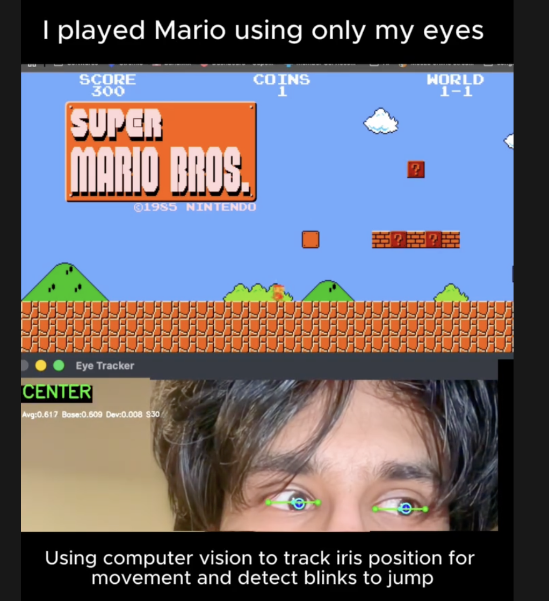

# Eye-Tracked Input

Eye-tracking system that translates gaze direction and blinks into keyboard inputs for hands-free gaming.

## Demo



<video src="demo.mp4" width="600" controls></video>

Played Super Mario Bros using this system: [supermarioplay.com](https://supermarioplay.com/)


## Features

- **Gaze Detection**: Look left/right to control movement
- **Blink Detection**: Blink to jump
- **Real-time Tracking**: Uses MediaPipe Face Mesh for facial landmark detection
- **Visual Feedback**: Live overlay showing iris position and gaze direction

## Controls

- Look **LEFT** → Left arrow key
- Look **RIGHT** → Right arrow key  
- **BLINK** → Up arrow key (jump)
- Can combine: Look left/right + blink for movement + jump

## Tech Stack

- Python
- MediaPipe (face mesh detection)
- OpenCV (camera capture & rendering)
- pynput (keyboard simulation)


## Installation

```bash
# Create virtual environment
python -m venv venv

# Activate virtual environment
# On macOS/Linux:
source venv/bin/activate
# On Windows:
# venv\Scripts\activate

# Install dependencies
pip install -r requirements.txt

# Run the application
python src/main.py
```
